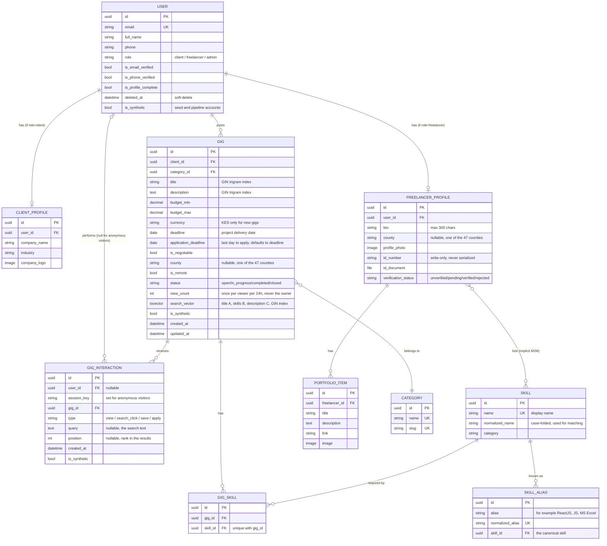

# Entity Relationship Diagram

Core domain entities as of Sprint 3.1. `NotificationPreference`, `UserSession` and `OTP`
(supporting tables in `accounts` and `usersettings`) are left out of the diagram to keep it
readable. See `backend/*/models.py` for their full definitions. `Application` and
`ApplicationStatusEvent` arrive in Sprint 4.

## Notes

- `User` does not have a single `Profile`. The profile is split into `ClientProfile` and
  `FreelancerProfile` depending on `role`, each created by a `post_save` signal. The
  `is_synthetic` flag lives on `User` and covers the profile rows that hang off it.
- Counties come from one list in `backend/profiles/counties.py`. Both `county` columns take their
  choices from it, and the frontend reads it from `GET /api/meta/counties/`.
- `Gig.search_vector` is kept current by `post_save` and `m2m_changed` signals. Anything that
  bypasses them (`bulk_create`, `QuerySet.update()`, a skill rename, a skill merge) needs
  `python manage.py rebuild_search_vectors` afterwards.
- `GigInteraction` rows of type `view` are written by the gig detail endpoint and double as the
  record used to count a view only once per viewer per 24 hours. `search_click` comes from the
  Browse page. `apply` is written by the applications flow in Sprint 4, and `save` has no
  producer yet.
- Indexes on `gigs_gig`: GIN on `search_vector`, GIN trigram on `title` and on `description`, and B-tree on
  `(status, created_at)`, `(status, category)`, `deadline`, `application_deadline`, `budget_min`
  and `budget_max`. On `gigs_giginteraction`: `(user, gig)` and `(type, created_at)`.
