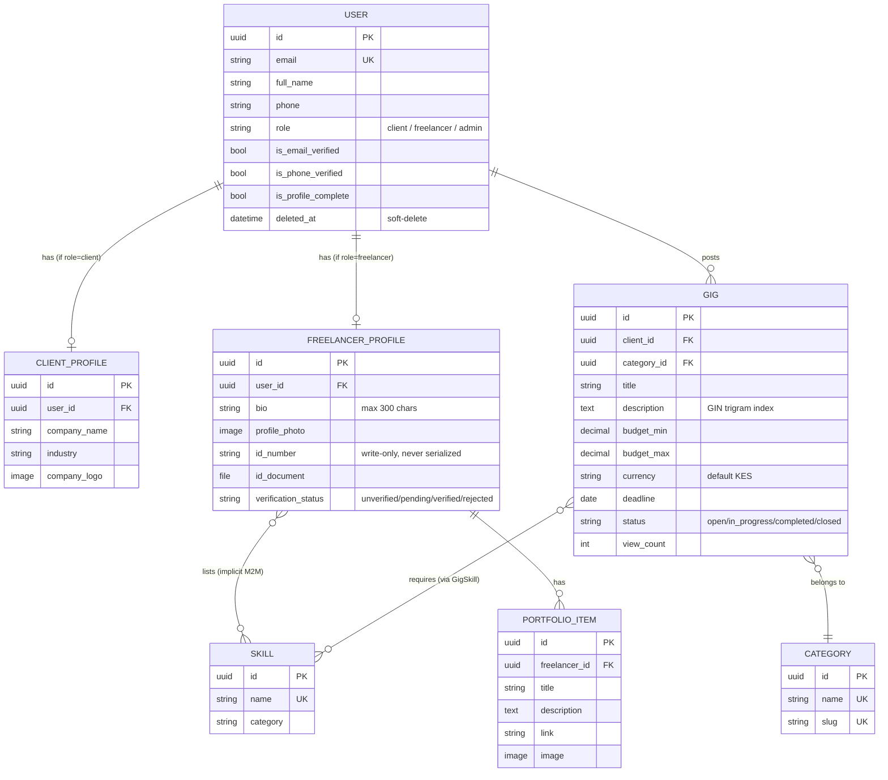

# Entity Relationship Diagram

Core domain entities as of Sprint 2. `NotificationPreference`, `UserSession`, and `OTP`
(supporting tables in `accounts`/`usersettings`) are omitted from the diagram to keep it
readable — see `backend/*/models.py` for their full definitions.

Note: `User` does not have a single `Profile` — the profile is split into `ClientProfile` and
`FreelancerProfile` depending on `role`, each auto-created via a `post_save` signal. There is
no `county` field on any model yet.
